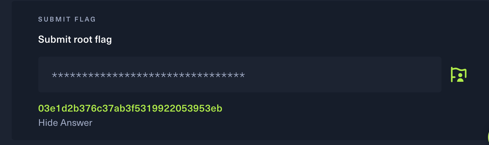

## 1. FTP

**File Transfer Protocol (FTP)** is a standard network protocol used to **transfer files between two computers** over a network.

You can use FTP to:

- **Upload** files from your local machine to a server
- **Download** files from a server to your computer

## 2.SFTP

**SFTP (SSH File Transfer Protocol)** is a secure file transfer protocol designed based on SSH.
While similar to FTP, it **encrypts all data and login credentials**, making it a modern and secure alternative.

SFTP typically uses **port 22**.

## 3. 🔍 Using Nmap and FTP

First, I connected to the HTB VPN using the provided `.ovpn` configuration file:
```bash
sudo openvpn ~/Downloads/start.ovpn
```
Once connected, I scanned the target machine (10.129.80.226) using Nmap to identify open ports and services:
```bash
nmap -sV -Pn 10.129.80.226
```
- **-sV** This helps identify the software/service running on each open port.
- **-Pn** This is to skips host discovery (ping), assuming the host is online.
- **Ping** is a network utility that sends an ICMP Echo Request to a target server to check if it is online.
If the server is reachable and responds, it replies with an ICMP Echo Reply, essentially saying “I’m here.”
```bash
ping 10.129.80.226
```
The response:

<pre>
PORT     STATE  SERVICE  VERSION
21/tcp   open   ftp      vsftpd 3.0.3
</pre>

From this respond we can know that:

(1) The FTP service is open and running vsftpd version 3.0.3.

(2) Based on the Nmap scan results, it can be inferred that the target machine is likely running a Unix-based operating system.
	    •	Service Info: OS: Unix

The result revealed that port 21 (FTP) was open. I then attempted to connect to the FTP service.

### 📘 FTP Help Information (`ftp -?` or `ftp --help`)

Running `ftp -?` or `ftp --help` provides helpful usage information. It includes:

- ✅ What command-line arguments FTP accepts  
- 🌐 How to connect to an FTP host  
- 🔗 Supported URL formats (e.g., `ftp://`, `file:///`)  
- 📄 Available FTP subcommands such as:
  - `ls` – list files
  - `get` – download file
  - `put` – upload file
 
```bash
ftp 10.129.80.226
```
### 🔐 Anonymous Login in FTP

In the FTP protocol, there's a feature called **anonymous login**.  
This allows users to **log into an FTP server without a username and password**, typically used for public file sharing.

When you successfully log in via FTP, the server responds with:

230 Login successful

-- 
### 📁 Common FTP Commands

- `ls` – Lists files in the current directory  
- `get [filename]` – Downloads a file from the FTP server

--
### Whole process of FTP:
```bash
# Connect to HTB VPN
sudo openvpn ~/Downloads/start.ovpn

# Scan the target machine (10.129.80.226) for open ports and services
nmap -sV -Pn 10.129.80.226

# Connect to the FTP service by using ftp 
ftp 10.129.80.226

# Use anonymous login
Name: anonymous
Password: <just press Enter>

# List files in the directory
ls

# Download the flag file
get flag.txt

# Exit the FTP session
exit

# Read the flag
cat flag.txt
```
--

## 4. 🔍 SMB (Server Message Block)
**SMB** is a **network protocol** used to enable **file, printer, and resource sharing** between computers on a network. It is commonly used for:

- 🖥️ **Network drive sharing** in Windows systems  
- 🔐 **Domain login authentication**  
- 📁 **File and folder transfers**

The most common port used is:
- **-L:** To list the shared resources on a specific host, use the -L option.
- **Port:** `445`  
- **Service name:** `microsoft-ds`

### Whole process of SMB:
```bash
# Scan the target machine (10.129.188.98) to detect open ports and service versions
nmap -sV -Pn 10.129.188.98

# List available SMB shares on the target
smbclient -L //10.129.188.98

# Connect to a specific share named "WorkShares"
smbclient //10.129.188.98/WorkShares

# List the contents of the share
ls

# Change directory within the share
cd <directory>

# Download a file from the share
get <filename>
```

-- 
## 5. 🔍 TCP(Transmission Control Protocol)

**TCP** is a reliable, connection-oriented communication protocol that ensures data sent between two devices is:

- **Not lost** (automatically retransmitted if errors occur)
- **Not duplicated**
- **Delivered in the correct order**

Port **445** is commonly used with TCP for **SMB (Server Message Block)** file-sharing services.
To scan all the ports and help increase the speed of scanning, we can use the `--min-rate=1000` flag:

- `--min-rate` is a **scan timing option** in Nmap that controls how fast probes are sent.
- The number `1000` means:
  > Send **at least 1000 packets per second**.


```bash
#target machine (10.129.168.4)
# -p- means scan TCP ports
# use --min-rate= 1000 increase the scanning time at least 1000 packets per second
sudo nmap -p- -Pn --min-rate=1000 10.129.168.4
```

The response after scanning the port:

<pre>
PORT      STATE  SERVICE
6379/tcp  open   redis
</pre>

From the respond , we can know that there is one port is open which is 6379/tcp, the service is called redis.

**Redis:** It is a high-performance in memeory data store, usaully used as a cache or message broker.

Redis is a in-memory data store and it keep the data in RAM not in the disk, which means that it offer:

Extremely high access rate
Optimally suited for caching, real-time analysis, and temporary data storage
Suitable for queue systems and temporary storage.

🛠️ **redis-cli (Redis Command-Line Interface)**

redis-cli is the command-line tool for interacting with a Redis server. It can be used to:

Connect to a Redis server , execute Redis commands(such as GET, SET ,  and debug and test Redis functionality.

### Whole process of TCP:
```bash
#scan all tcp ports of the target machine(10.129.168.4)
# use --min-rate=1000 to increase the scanning speed
sudo nmap -p- -Pn --min-rate=1000 10.129.168.4

#from the response we can know that the sevice of this port is redis
#use redis-cli to connect target machine
redis-cli -h 10.129.168.4

#Use DBSIZE to check how many key
#The result shows 4 keys
DBSIZE

#Use KEYS* to find the keys name
#The result shows the key of name are: flag, numb, temp , stor
KEYS*

#We can use GET to download the flag file
GET flag

```
