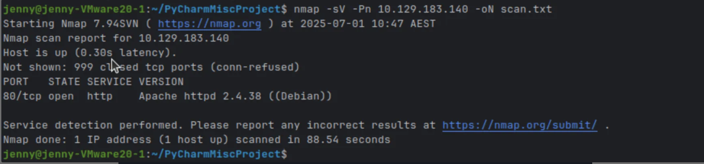
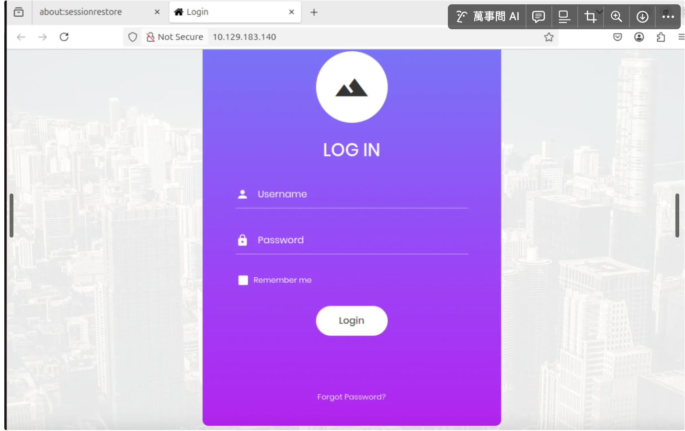
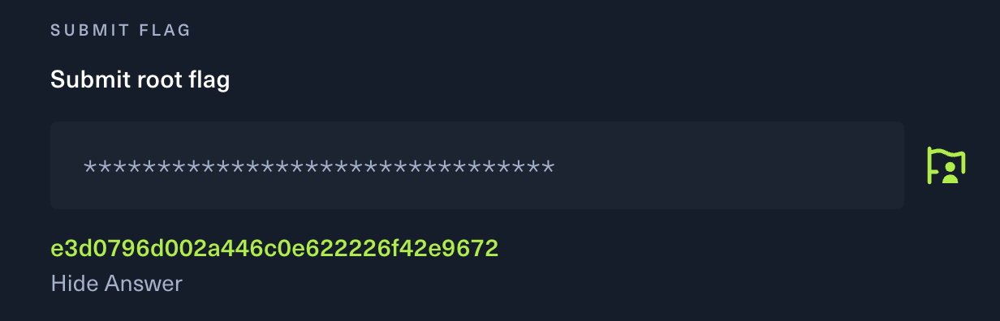

## Task 1

### 🗄️ Structured Query Language (SQL)

### What is SQL Injection?

SQL Injection is a type of vulnerability that allows attackers to interfere with the queries an application makes to its database. It can be used to:

-  **Bypass login authentication**
-  **View, modify, or delete data in the database**
-  **Perform administrative operations**
-  **Even gain full control over the server**

The top 10 classification SQL injection, A03: 2021-Injection have high risks.

### Process of task 1
1. Scan port using nmap to the target machine cause we need to get the information of the port:
    ```bash
    nmap -sV -Pn 10.129.183.140
    ```
   

   From this image , it shows that there is one port open which is tcp and the service is http.

   This means that it is a website.
   
2. I tried to open the wesite to check if it is work or not and we found that we can get into the website:
   ```bash
   http://10.129.183.140
   ```
    
   
3. I tried to use the method of SQL injection by using  '1 = 1;--' , which means let login always true.
   
   This works because `1 = 1` is always true, and the `--` sequence comments out the rest of the SQL query.
   
   This tricks the application into logging you in without a valid password.
   
   And i found that i can log into the website , and then we get the flag.
   
    ```bash
    #i type 1=1; -- in the login part and log in successfully
   1 = 1; -- 
   ```


--

###Task 2 
   
